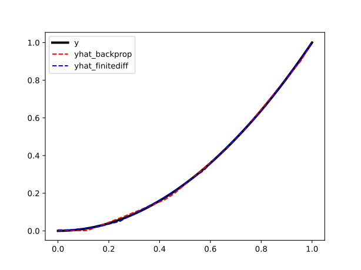

<h5 align="center">
 <br>

<br>

[**Installation**](#installation)
|[**Examples**](#examples)


[](https://pepy.tech/project/FiniteDiffX)
[](https://codecov.io/github/ASEM000/FiniteDiffX)  
[](https://colab.research.google.com/github/ASEM000/FiniteDiffX/blob/main/FiniteDiffX%20Examples.ipynb)


</h5>

Differentiable finite difference tools in `jax`
Implements :

**`Array` accepting functions:**

- `difference(array, axis, accuracy, step_size, method, derivative)`
- `gradient(array, accuracy, method, step_size)`
- `jacobian(array, accuracy, method, step_size)`
- `divergence(array, accuracy, step_size, method, keepdims)`
- `hessian(array, accuracy, method, step_size)`
- `laplacian(array, accuracy, method, step_size)`
- `curl(array, step_size, method, keep_dims)`

**Function transformation:**

- `fgrad`, and `value_and_fgrad` : similar to `jax.grad` and `jax.value_and_grad` but with finite difference approximation.
- `define_fdjvp`: define `custom_jvp` rules using finite difference approximation (see example below).

## 🛠️ Installation<a id="installation"></a>

```python
pip install FiniteDiffX
```

**Install development version**

```python
pip install git+https://github.com/ASEM000/FiniteDiffX
```

**If you find it useful to you, consider giving it a star! 🌟**

<br>

## ⏩ Examples<a id="examples"></a>

### **`Array` accepting functions:**

```python

import jax
jax.config.update("jax_enable_x64", True)
import jax.numpy as jnp
import numpy.testing as npt

import finitediffx as fdx

# lets first define a vector valued function F: R^3 -> R^3
# F = F1, F2
# F1 = x^2 + y^3
# F2 = x^4 + y^3
# F3 = 0
# F = [x**2 + y**3, x**4 + y**3, 0]

x, y, z = [jnp.linspace(0, 1, 100)] * 3
dx, dy, dz = x[1] - x[0], y[1] - y[0], z[1] - z[0]
X, Y, Z = jnp.meshgrid(x, y, z, indexing="ij")
F1 = X**2 + Y**3
F2 = X**4 + Y**3
F3 = jnp.zeros_like(F1)
F = jnp.stack([F1, F2, F3], axis=0)

```

<details>

<summary>Difference</summary>

```python

# ∂F1/∂x : differentiate F1 with respect to x (i.e axis=0)
dF1dx = fdx.difference(F1, axis=0, step_size=dx, accuracy=6, method="central")
dF1dx_exact = 2 * X
npt.assert_allclose(dF1dx, dF1dx_exact, atol=1e-7)

# ∂F2/∂y : differentiate F2 with respect to y (i.e axis=1)
dF2dy = fdx.difference(F2, axis=1, step_size=dy, accuracy=6)
dF2dy_exact = 3 * Y**2
npt.assert_allclose(dF2dy, dF2dy_exact, atol=1e-7)

```

</details>

<details>

<summary>Divergence</summary>

```python

# ∇.F : the divergence of F
divF = fdx.divergence(F, step_size=(dx, dy, dz), keepdims=False, accuracy=6, method="central")
divF_exact = 2 * X + 3 * Y**2
npt.assert_allclose(divF, divF_exact, atol=1e-7)

```

</details>

<details>

<summary>Gradient</summary>

```python

# ∇F1 : the gradient of F1
gradF1 = fdx.gradient(F1, step_size=(dx, dy, dz), accuracy=6, method="central")
gradF1_exact = jnp.stack([2 * X, 3 * Y**2, 0 * X], axis=0)
npt.assert_allclose(gradF1, gradF1_exact, atol=1e-7)

```

</details>

<details>

<summary>Laplacian</summary>

```python

# ΔF1 : laplacian of F1
lapF1 = fdx.laplacian(F1, step_size=(dx, dy, dz), accuracy=6, method="central")
lapF1_exact = 2 + 6 * Y
npt.assert_allclose(lapF1, lapF1_exact, atol=1e-7)

```

</details>

<details>

<summary>Curl</summary>

```python

# ∇xF : the curl of F
curlF = fdx.curl(F, step_size=(dx, dy, dz), accuracy=6, method="central")
curlF_exact = jnp.stack([F1 * 0, F1 * 0, 4 * X**3 - 3 * Y**2], axis=0)
npt.assert_allclose(curlF, curlF_exact, atol=1e-7)

```

</details>

<details>

<summary>Jacobian</summary>

```python

# Jacobian of F
JF = fdx.jacobian(F, accuracy=4, step_size=(dx, dy, dz), method="central")
JF_exact = jnp.array(
    [
        [2 * X, 3 * Y**2, jnp.zeros_like(X)],
        [4 * X**3, 3 * Y**2, jnp.zeros_like(X)],
        [jnp.zeros_like(X), jnp.zeros_like(X), jnp.zeros_like(X)],
    ]
)
npt.assert_allclose(JF, JF_exact, atol=1e-7)

```

</details>

<details>

<summary>Hessian</summary>

```python

# Hessian of F1
HF1 = fdx.hessian(F1, accuracy=4, step_size=(dx, dy, dz), method="central")
HF1_exact = jnp.array(
    [
        [
            2 * jnp.ones_like(X),  # ∂2F1/∂x2
            0 * jnp.ones_like(X),  # ∂2F1/∂xy
            0 * jnp.ones_like(X),  # ∂2F1/∂xz
        ],
        [
            0 * jnp.ones_like(X),  # ∂2F1/∂yx
            6 * Y**2,              # ∂2F1/∂y2
            0 * jnp.ones_like(X),  # ∂2F1/∂yz
        ],
        [
            0 * jnp.ones_like(X),  # ∂2F1/∂zx
            0 * jnp.ones_like(X),  # ∂2F1/∂zy
            0 * jnp.ones_like(X),  # ∂2F1/∂z2
        ],
    ]
)
npt.assert_allclose(JF, JF_exact, atol=1e-7)

```

</details>

<br><br>

### **Function transformation:**

**`fgrad`**:

`fgrad` can be used in a similar way to `jax.grad`, however the `fgrad` differentiates a function based on the finite difference rules.

<details> <summary> Example </summary>

```python

import jax
from jax import numpy as jnp
import numpy as onp  # Not jax-traceable
import finitediffx as fdx
import functools as ft
from jax.experimental import enable_x64

with enable_x64():

    @fdx.fgrad
    @fdx.fgrad
    def np_rosenbach2_fdx_style_1(x, y):
        """Compute the Rosenbach function for two variables in numpy."""
        return onp.power(1-x, 2) + 100*onp.power(y-onp.power(x, 2), 2)

    @ft.partial(fdx.fgrad, derivative=2)
    def np2_rosenbach2_fdx_style2(x, y):
        """Compute the Rosenbach function for two variables."""
        return onp.power(1-x, 2) + 100*onp.power(y-onp.power(x, 2), 2)

    @jax.grad
    @jax.grad
    def jnp_rosenbach2(x, y):
        """Compute the Rosenbach function for two variables."""
        return jnp.power(1-x, 2) + 100*jnp.power(y-jnp.power(x, 2), 2)

    print(np_rosenbach2_fdx_style_1(1.,2.))
    print(np2_rosenbach2_fdx_style2(1.,2.))
    print(jnp_rosenbach2(1., 2.))
# 402.0000951997936
# 402.0000000002219
# 402.0
```

</details>

<details>

<summary>Train a simple neural network using finitediff vs backprop </summary>

```python

import jax
import jax.numpy as jnp
import matplotlib.pyplot as plt

x = jnp.linspace(0, 1, 1_000)[:, None]
y = x**2

params = {
    "w1": jax.random.uniform(jax.random.PRNGKey(0), shape=[1, 20]),
    "b1": jnp.zeros([20]),
    "w2": jax.random.uniform(jax.random.PRNGKey(0), shape=[20, 1]),
    "b2": jnp.zeros([1]),
}


def forward(params: dict[str, jax.Array], x: jax.Array):
    x = x @ params["w1"] + params["b1"]
    x = jax.nn.relu(x)
    x = x @ params["w2"] + params["b2"]
    return x


def loss_func(params: dict[str, jax.Array], x: jax.Array, y: jax.Array):
    ypred = forward(params, x)
    return jnp.mean((ypred - y) ** 2)


@jax.jit
def backprop_train_step(
    params: dict[str, jax.Array],
    x: jax.Array,
    y: jax.Array,
    lr: float,
):
    loss, grads = jax.value_and_grad(loss_func)(params, x, y)
    params = {k: v - lr * grads[k] for k, v in params.items()}
    return params, loss


@jax.jit
def forward_train_step(
    params: dict[str, jax.Array],
    x: jax.Array,
    y: jax.Array,
    lr: float,
):
    loss, grads = fdx.value_and_fgrad(loss_func)(params, x, y)
    params = {k: v - lr * grads[k] for k, v in params.items()}
    return params, loss


def train(
    params: dict[str, jax.Array],
    x: jax.Array,
    y: jax.Array,
    lr: float,
    epochs: int,
    fd_grad: bool = False,
):
    train_step = forward_train_step if fd_grad else backprop_train_step

    for epoch in range(1, epochs + 1):
        params, loss = train_step(params, x, y, lr)
        if epoch % 1_000 == 0:
            print(f"Epoch {epoch} loss {loss:.3e}")
    return params


print("backprop training")
params_backprop = train(params, x, y, lr=1e-2, epochs=10_000, fd_grad=False)

print("\nfinitediff training")
params_forward = train(params, x, y, lr=1e-2, epochs=10_000, fd_grad=True)

yhat_backprop = forward(params_backprop, x)
yhat_forward = forward(params_forward, x)

plt.plot(x, y, "-k", label="y", linewidth=3)
plt.plot(x, yhat_backprop, "--r", label="yhat_backprop")
plt.plot(x, yhat_forward, "--b", label="yhat_finitediff")
plt.legend()

# backprop training
# Epoch 1000 loss 2.005e-02
# Epoch 2000 loss 1.237e-02
# Epoch 3000 loss 4.084e-03
# Epoch 4000 loss 7.694e-04
# Epoch 5000 loss 5.541e-04
# Epoch 6000 loss 4.421e-04
# Epoch 7000 loss 2.853e-04
# Epoch 8000 loss 1.073e-04
# Epoch 9000 loss 4.786e-05
# Epoch 10000 loss 3.234e-05

# finitediff training
# Epoch 1000 loss 3.307e-03
# Epoch 2000 loss 2.012e-04
# Epoch 3000 loss 5.370e-05
# Epoch 4000 loss 3.066e-05
# Epoch 5000 loss 2.365e-05
# Epoch 6000 loss 1.993e-05
# Epoch 7000 loss 1.718e-05
# Epoch 8000 loss 1.487e-05
# Epoch 9000 loss 1.289e-05
# Epoch 10000 loss 1.122e-05

```



</details>

<br>

**`define_fdjvp`**

`define_fdjvp` combines `custom_jvp` and `fgrad` to define custom finite difference rules,when used with `pure_callback` it can to make non-tracable code works within `jax` machinary.

<details> <summary> Example </summary>

_This example is based on the comment from `jax` proposed [`JEP`](https://github.com/google/jax/issues/15425)_

For example this code will fail to work with `jax` transformations, becasue it uses `numpy` functions.

```python
import numpy as onp
import jax


def numpy_func(x: onp.ndarray) -> onp.ndarray:
    return onp.power(x, 2)


try:
    jax.grad(numpy_func)(2.0)
except jax.errors.TracerArrayConversionError as e:
    print(e)

# The numpy.ndarray conversion method __array__() was called on the JAX Tracer object Traced<ConcreteArray(2.0, dtype=float32, weak_type=True)>with<JVPTrace(level=2/0)> with
#   primal = 2.0
#   tangent = Traced<ShapedArray(float32[], weak_type=True)>with<JaxprTrace(level=1/0)> with
#     pval = (ShapedArray(float32[], weak_type=True), None)
#     recipe = LambdaBinding()
# See https://jax.readthedocs.io/en/latest/errors.html#jax.errors.TracerArrayConversionError
```

We can use `define_fdjvp` to make this work with non-`jax` code

```python

import functools as ft

import jax
from typing import Callable, Any, Union
import jax.numpy as jnp
import numpy as onp
import finitediffx as fdx
import functools as ft


def wrap_pure_callback(func):
    @ft.wraps(func)
    def wrapper(*args, **kwargs):
        args = [jnp.asarray(arg) for arg in args]
        func_ = lambda *a, **k: func(*a, **k).astype(a[0].dtype)
        dtype_ = jax.ShapeDtypeStruct(
            jnp.broadcast_shapes(*[ai.shape for ai in args]),
            args[0].dtype,
        )
        return jax.pure_callback(func_, dtype_, *args, **kwargs, vectorized=True)

    return wrapper


@jax.jit  # -> can compile
@jax.grad  # -> can take gradient
@ft.partial(
    fdx.define_fdjvp,
    # automatically generate offsets
    offsets=fdx.Offset(accuracy=4),
    # manually set step size
    step_size=1e-3,
)
@wrap_pure_callback
def numpy_func(x: onp.ndarray) -> onp.ndarray:
    return onp.power(x, 2)


print(numpy_func(1.0))
# 1.9999794

@jax.jit  # -> can compile
@jax.grad  # -> can take gradient
@ft.partial(
    fdx.define_fdjvp,
    # provide the desired evaluation points for the finite difference stencil
    # in this case its centered finite difference (f(x-1) - f(x+1))/(2*step_size)
    offsets=jnp.array([1, -1]),
    # manually set step size
    step_size=1e-3,
)
@wrap_pure_callback
def numpy_func(x: onp.ndarray) -> onp.ndarray:
    return onp.power(x, 2)

print(numpy_func(1.0))
# 2.0000048
```

</details>
